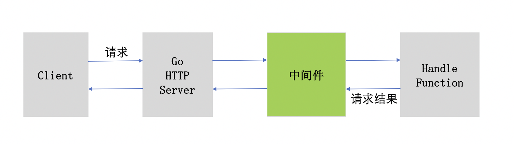
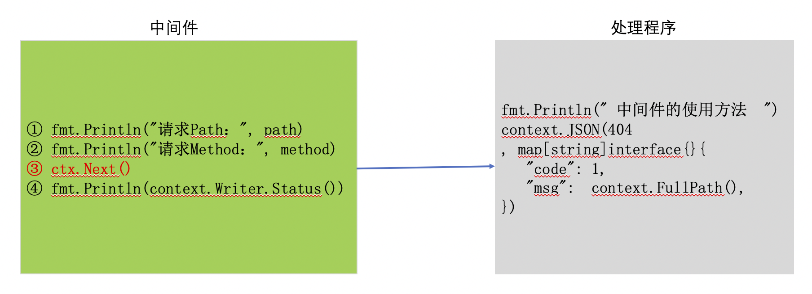

# Gin框架解析
+ ##Engine（引擎）  
````
type Engine struct {
    RouterGroup        //路由组
    RedirectTrailingSlash bool
    RedirectFixedPath bool
    HandleMethodNotAllowed bool
    ForwardedByClientIP    bool
    AppEngine bool
    UseRawPath bool
    UnescapePathValues bool
    MaxMultipartMemory int64
    delims           render.Delims
    secureJsonPrefix string
    HTMLRender       render.HTMLRender
    FuncMap          template.FuncMap
    allNoRoute       HandlersChain
    allNoMethod      HandlersChain
    noRoute          HandlersChain
    noMethod         HandlersChain
    pool             sync.Pool
    trees            methodTrees   //方法树
}
````
1.RouterGroup（路由组）  
描述的是路由的父节点（父节点请查看离散数学）里面包含了父节点的一些属性。  
RouteGroup的作用就是为每一个服务请求提供解析功能，并指定每一个请求对应的处理程序。 
````
type RouterGroup struct {
    Handlers HandlersChain //父节点路由的监听器，实际上最后也是一个带有上下文指针的回调
    basePath string  //路由路径，相对于子路由的上级路径
    engine   *Engine //父节点路由的Engine实体
    root     bool   //是否为根节点路由
}
````
2.几个重要的bool类型变量，针对重定向、转发等属性控制（反正我不是很懂）  
pool变量挺重要的,但我不算是太懂。  
````
type Pool struct {
    noCopy noCopy

    local     unsafe.Pointer // local fixed-size per-P pool, actual type is [P]poolLocal
    localSize uintptr        // size of the local array

    // New optionally specifies a function to generate
    // a value when Get would otherwise return nil.
    // It may not be changed concurrently with calls to Get.
    New func() interface{}
}
````
如上即是pool的结构体，他是对服务器处理请求定义的一个线程池模型（正如他名字的翻译）  
里面包含了其最大上限，以及每个线程的处理，源码里有讲解（太长了，没法在这展示）。  
engine中可以直接进行HTTP请求的处理，在engine中使用Handle方法进行http请求的处理。  
Handle方法包含三个参数，具体如下所示：

```
func (group *RouterGroup) Handle(httpMethod, relativePath string, handlers ...HandlerFunc) IRoutes
```

* httpMethod：第一个参数表示要处理的HTTP的请求类型，是GET、POST、DELETE等8种请求类型中的一种。

* relativePath：第二个参数表示要解析的接口，由开发者进行定义。

* handlers：第三个参数是处理对应的请求的代码的定义。
+ ##gin.Default  
````
func Default() *Engine {
	debugPrintWARNINGDefault()
	engine := New()
	engine.Use(Logger(), Recovery())
	return engine
}
````  
gin.Default()和gin.New()的区别在于gin.Default也使用gin.New()创建engine实例，  
但是会默认使用Logger和Recovery中间件（我觉得这些中间键用处不是很大，基本就是打印个日志，一般好像我也没碰到过因为连接有报啥错）。
### 1.debugPrintWARNINGDefault() 
无非是打印了一些日志
````
func debugPrintWARNINGDefault() {
	if v, e := getMinVer(runtime.Version()); e == nil && v <= ginSupportMinGoVer {
		debugPrint(`[WARNING] Now Gin requires Go 1.10 or later and Go 1.11 will be required soon.

`)
	}
	debugPrint(`[WARNING] Creating an Engine instance with the Logger and Recovery middleware already attached.

`)
}
````
###2.engine := New()   
````
func New() *Engine {
    debugPrintWARNINGNew()
    engine := &Engine{
        RouterGroup: RouterGroup{
            Handlers: nil,
            basePath: "/",
            root:     true,
        },
        FuncMap:                template.FuncMap{},
        RedirectTrailingSlash:  true,
        RedirectFixedPath:      false,
        HandleMethodNotAllowed: false,
        ForwardedByClientIP:    true,
        AppEngine:              defaultAppEngine,
        UseRawPath:             false,
        UnescapePathValues:     true,
        MaxMultipartMemory:     defaultMultipartMemory,
        trees:                  make(methodTrees, 0, 9),
        delims:                 render.Delims{Left: "{{", Right: "}}"},
        secureJsonPrefix:       "while(1);",
    }
    engine.RouterGroup.engine = engine
    engine.pool.New = func() interface{} {
        return engine.allocateContext()
    }
    return engine
}
````
第一步，构造了Engine对象，并传入所需参数。  
第二部，将engine父节点指向自己（因为没有对路由分组，才开始，路由没创建，哪里有分组）。  
第三步，将pool的New变量指向了一个匿名函数，返回含有engine的Context。   
匿名函数： 
````
func (engine *Engine) allocateContext() *Context {
    return &Context{engine: engine}
}
````
Context结构体：  
````
type Context struct {
        writermem responseWriter
        Request   *http.Request
        Writer    ResponseWriter
    
        Params   Params
        handlers HandlersChain
        index    int8
    
        engine *Engine
    
        // Keys is a key/value pair exclusively for the context of each request.
        Keys map[string]interface{}
    
        // Errors is a list of errors attached to all the handlers/middlewares who used this context.
        Errors errorMsgs
    
        // Accepted defines a list of manually accepted formats for content negotiation.
        Accepted []string
    }
````
里面包含了请求的许多参数（原谅我有点还看不懂emm/doge）  
###3.engine.Use(Logger(), Recovery())  
  传入了默认的中间键，日志与基本的异常处理。（也可以自定义的，看你）。  
  Logger与Recovery源码：
  ````
func Logger() HandlerFunc {
    return LoggerWithWriter(DefaultWriter)
}

func LoggerWithWriter(out io.Writer, notlogged ...string) HandlerFunc {
    isTerm := true

    if w, ok := out.(*os.File); !ok ||
        (os.Getenv("TERM") == "dumb" || (!isatty.IsTerminal(w.Fd()) && !isatty.IsCygwinTerminal(w.Fd()))) ||
        disableColor {
        isTerm = false
    }

    var skip map[string]struct{}

    if length := len(notlogged); length > 0 {
        skip = make(map[string]struct{}, length)

        for _, path := range notlogged {
            skip[path] = struct{}{}
        }
    }

    return func(c *Context) {
        // Start timer
        start := time.Now()
        path := c.Request.URL.Path
        raw := c.Request.URL.RawQuery

        // Process request
        c.Next()

        // Log only when path is not being skipped
        if _, ok := skip[path]; !ok {
            // Stop timer
            end := time.Now()
            latency := end.Sub(start)

            clientIP := c.ClientIP()
            method := c.Request.Method
            statusCode := c.Writer.Status()
            var statusColor, methodColor, resetColor string
            if isTerm {
                statusColor = colorForStatus(statusCode)
                methodColor = colorForMethod(method)
                resetColor = reset
            }
            comment := c.Errors.ByType(ErrorTypePrivate).String()

            if raw != "" {
                path = path + "?" + raw
            }

            fmt.Fprintf(out, "[GIN] %v |%s %3d %s| %13v | %15s |%s %-7s %s %s\n%s",
                end.Format("2006/01/02 - 15:04:05"),
                statusColor, statusCode, resetColor,
                latency,
                clientIP,
                methodColor, method, resetColor,
                path,
                comment,
            )
        }
    }
}
````  
主要是对请求参数的打印,Recovery:  
````
func Recovery() HandlerFunc {
    return RecoveryWithWriter(DefaultErrorWriter)
}
func RecoveryWithWriter(out io.Writer) HandlerFunc {
    var logger *log.Logger
    if out != nil {
        logger = log.New(out, "\n\n\x1b[31m", log.LstdFlags)
    }
    return func(c *Context) {
        defer func() {
            if err := recover(); err != nil {
                if logger != nil {
                    stack := stack(3)
                    httprequest, _ := httputil.DumpRequest(c.Request, false)
                    logger.Printf("[Recovery] %s panic recovered:\n%s\n%s\n%s%s", timeFormat(time.Now()), string(httprequest), err, stack, reset)
                }
                c.AbortWithStatus(http.StatusInternalServerError)
            }
        }()
        c.Next()
    }
}
````
最终将异常信息输入到日志中  
+ ##请求监听器设置（这个定义我不赞同）  
理由：我觉得这个就类似网页伪装（伪装成一个网页接受or传递数据，感觉这个名字好绕口）  
#### HTTP请求类型
http协议中一共定义了八种方法或者称之为类型来表明对请求网络资源（Request-URI）的不同的操作方式，分别是：   
OPTIONS、HEAD、GET、POST、PUT、DELETE、TRACE、CONNECT。
虽然一共有八种请求操作类型，但是实际开发中常用的就：   
GET、POST、DELETE等几种。
###1.以get为例（post等其他请求其实都是一样的，一同百通）  
Get请求函数：  
````
func (group *RouterGroup) GET(relativePath string, handlers ...HandlerFunc) IRoutes {
       return group.handle("GET", relativePath, handlers)
   }
   
   func (group *RouterGroup) handle(httpMethod, relativePath string, handlers HandlersChain) IRoutes {
       absolutePath := group.calculateAbsolutePath(relativePath)
       handlers = group.combineHandlers(handlers)
       group.engine.addRoute(httpMethod, absolutePath, handlers)
       return group.returnObj()
   }

````  
这个和Engine模型有关系（其实是用了继承，大概是吧。没分清继承和重写的区别）。  
1.去的监听器监听路由的绝对完整路径：
````
func (group *RouterGroup) calculateAbsolutePath(relativePath string) string {
    return joinPaths(group.basePath, relativePath)
}
func joinPaths(absolutePath, relativePath string) string {
    if relativePath == "" {
        return absolutePath
    }

    finalPath := path.Join(absolutePath, relativePath)
    appendSlash := lastChar(relativePath) == '/' && lastChar(finalPath) != '/'
    if appendSlash {
        return finalPath + "/"
    }
    return finalPath
}

````  
2.讲group,父节点下所有监听器合并：
```
func (group *RouterGroup) combineHandlers(handlers HandlersChain) HandlersChain {
    finalSize := len(group.Handlers) + len(handlers)
    if finalSize >= int(abortIndex) {
        panic("too many handlers")
    }
    mergedHandlers := make(HandlersChain, finalSize)
    copy(mergedHandlers, group.Handlers)
    copy(mergedHandlers[len(group.Handlers):], handlers)
    return mergedHandlers
}

```   
3.将所得消息添加到父节点中，返回：  
```
func (engine *Engine) addRoute(method, path string, handlers HandlersChain) {
    assert1(path[0] == '/', "path must begin with '/'")
    assert1(method != "", "HTTP method can not be empty")
    assert1(len(handlers) > 0, "there must be at least one handler")

    debugPrintRoute(method, path, handlers)
    root := engine.trees.get(method)
    if root == nil {
        root = new(node)
        engine.trees = append(engine.trees, methodTree{method: method, root: root})
    }
    root.addRoute(path, handlers)
}

```  
举例如下：

##### Handle处理GET请求
```
engine.Handle("GET", "/hello", func(context *gin.Context) {
	//获取请求接口
	fmt.Println(context.FullPath())
	//获取字符串参数
	name := context.DefaultQuery("name", "")
	fmt.Println(name)

	//输出
	context.Writer.Write([]byte("Hello ," + name))
})
```

通过Handle方法第一个参数指定处理GET类型的请求，解析的接口是/hello。

Context是gin框架中封装的一个结构体，这是gin框架中最重要，最基础的一个结构体对象。该结构体可以提供我们操作请求，处理请求，获取数据等相关的操作，通常称之为上下文对象，简单说为我们提供操作环境。

可以通过context.Query和context.DefaultQuery获取GET请求携带的参数。

可以通过context.Writer.Write向请求发起端返回数据。
像上述这种只有username和password两个字段的表单数据进行提交时，可以使用context.PostForm和context.GetPostForm获取。但是如果表单数据较多时，使用PostForm和GetPostForm一次获取一个表单数据，开发效率较慢。

Gin框架提供给开发者表单实体绑定的功能，可以将表单数据与结构体绑定。
###  表单实体绑定
使用PostForm这种单个获取属性和字段的方式，代码量较多，需要一个一个属性进行获取。而表单数据的提交，往往对应着完整的数据结构体定义，其中对应着表单的输入项。gin框架提供了数据结构体和表单提交数据绑定的功能，提高表单数据获取的效率。如下所示：

以一个用户注册功能来进行讲解表单实体绑定操作。用户注册需要提交表单数据，假设注册时表单数据包含三项，分别为：username、phone和password。
```
type UserRegister struct {
	Username string `form:"username" binding:"required"`
	Phone    string `form:"phone" binding:"required"`
	Password string `form:"password" binding:"required"`
}
```
创建了UserRegister结构体用于接收表单数据，通过tag标签的方式设置每个字段对应的form表单中的属性名，通过binding属于设置属性是否是必须（即不为空）。
#### ShouldBindQuery
使用ShouldBindQuery可以实现Get方式的数据请求的绑定。具体实现如下：
```
type Student struct {
   	Name    string `form:"name"`
   	Classes string `form:"classes"`
   }
func main() {

	engine := gin.Default()

	// http://127.0.0.1:8080/login?name=邵泽森&classes=软件工程
	engine.GET("/login", func(context *gin.Context) {
		var student Student
		if err := context.ShouldBindQuery(&student); err != nil{
			log.Println(err.Error())
		}

		fmt.Println(student.Name)
		fmt.Println(student.Classes)
		context.Writer.Write([]byte("hello," + student.Name))
	})

	engine.Run()
}
```
此调用机制详见[CSDN博客](https://blog.csdn.net/weixin_43513459/article/details/105659194)（同样是太长了，懒得写）
##最兴奋的时候到了，Run起来！！！
```
func (engine *Engine) Run(addr ...string) (err error) {
    defer func() { debugPrintError(err) }()

    address := resolveAddress(addr)
    debugPrint("Listening and serving HTTP on %s\n", address)
    err = http.ListenAndServe(address, engine)
    return
}

func resolveAddress(addr []string) string {
    switch len(addr) {
    case 0:
        if port := os.Getenv("PORT"); port != "" {
            debugPrint("Environment variable PORT=\"%s\"", port)
            return ":" + port
        }
        debugPrint("Environment variable PORT is undefined. Using port :8080 by default")
        return ":8080"
    case 1:
        return addr[0]
    default:
        panic("too much parameters")
    }
}

func ListenAndServe(addr string, handler Handler) error {
    server := &Server{Addr: addr, Handler: handler}
    return server.ListenAndServe()
}

```  
就是得到配置的地址及端口，开启监听，传入地址端口和engine（一定要指针哦）。
  
### JSON
除了使用context.Writer对象返回[]byte和string类型的数据意外。在项目开发中，JSON格式规范使用的更为普遍。  
gin为了方便开发者更方便的使用该框架进行项目开发，直接支持将返回数据组装成JSON格式进行返回。

gin框架中的context包含的JSON方法可以将结构体类型的数据转换成JSON格式的结构化数据，然后返回给客户端。

#### map类型
编程调用如下所示：
```
engine := gin.Default()
engine.GET("/hellojson", func(context *gin.Context) {
	fullPath := "请求路径：" + context.FullPath()
	fmt.Println(fullPath)
	
	context.JSON(200, map[string]interface{}{
		"code":    1,
		"message": "OK",
		"data":    fullPath,
	})
})
engine.Run(":9000")	
```
如上,调用JSON将map类型的数据转换成为json格式并返回给前端，第一个参数200表示设置请求返回的状态码。和http请求的状态码一致。  
```
func (c *Context) JSON(code int, obj interface{}) {
	c.Render(code, render.JSON{Data: obj})
}
```
```
func (c *Context) Render(code int, r render.Render) {
	c.Status(code)

	if !bodyAllowedForStatus(code) {
		r.WriteContentType(c.Writer)
		c.Writer.WriteHeaderNow()
		return
	}

	if err := r.Render(c.Writer); err != nil {
		panic(err)
	}
}
```
通过上述方式即可发送Json类型数据（emm，感觉http简直无敌，其他格式数据传输类似）。  

###HTML模板  

有一说一，我也不知道到底有啥用（就是只能在后端直接加载静态页面，所以这个不算是前端的活）。  

### 中间件
在web应用服务中，完整的一个业务处理在技术上包含客户端操作、服务器端处理、返回处理结果给客户端三个步骤。

在实际的业务开发和处理中，会有更负责的业务和需求场景。一个完整的系统可能要包含鉴权认证、权限管理、安全检查、日志记录等多维度的系统支持。

鉴权认证、权限管理、安全检查、日志记录等这些保障和支持系统业务属于全系统的业务，和具体的系统业务没有关联，对于系统中的所有业务都适用。

由此，在业务开发过程中，为了更好的梳理系统架构，可以将上述描述所涉及的一些通用业务单独抽离并进行开发，然后以插件化的形式进行对接。  
这种方式既保证了系统功能的完整，同时又有效的将具体业务和系统功能进行解耦，并且，还可以达到灵活配置的目的。

这种通用业务独立开发并灵活配置使用的组件，一般称之为"中间件"，因为其位于服务器和实际业务处理程序之间。  
其含义就是相当于在请求和具体的业务逻辑处理之间增加某些操作，这种以额外添加的方式不会影响编码效率，也不会侵入到框架中。  
中间件的位置和角色示意图如下图所示：

    

#### 自定义中间件
根据上文的介绍，可以自己定义实现一个特殊需求的中间件，中间件的类型是函数，有两条标准：

* func函数

* 返回值类型为HandlerFunc

比如，我们自定义一个自己的中间件。在前面所学的内容中，我们在处理请求时，为了方便代码调试，通常都将请求的一些信息打印出来。有了中间件以后，为了避免代码多次重复编写，使用统一的中间件来完成。定义一个名为RequestInfos的中间件，在该中间件中打印请求的path和method。具体代码实现如下所示：
```
func RequestInfos() gin.HandlerFunc {
	return func(context *gin.Context) {
		path := context.FullPath()
		method := context.Request.Method
		fmt.Println("请求Path：", path)
		fmt.Println("请求Method：", method)
	}
}

func main() {

	engine := gin.Default()
	engine.Use(RequestInfos())

	engine.GET("/query", func(context *gin.Context) {
		context.JSON(200, map[string]interface{}{
			"code": 1,
			"msg":  context.FullPath(),
		})
	})
	engine.Run(":9000")
}

```
通过两条fmt.Println打印出了请求的信息，并通过engine.Use使用RequestInfos中间件。


运行程序，能够得到正确的返回JSON格式的数据：
```
{
    "code": 1,
    "msg": "/query"
}
```
####中间键Use用法  
Use函数接收一个可变参数，类型为HandlerFunc，恰为中间件的类型。Use方法定义如下：
```
func (engine *Engine) Use(middleware ...HandlerFunc) IRoutes {
	engine.RouterGroup.Use(middleware...)
	engine.rebuild404Handlers()
	engine.rebuild405Handlers()
	return engine
}
```  
### context.Next函数
通过一个例子和使用场景来说明Next函数的作用。

在上文自定义的中间件RequestInfos中，打印了请求了请求的path和method，接着去执行了正常的业务处理函数。  
如果我们想输出业务处理结果的信息，该如何实现呢。答案是使用context.Next函数。

context.Next函数可以将中间件代码的执行顺序一分为二，Next函数调用之前的代码在请求处理之前之前，当程序执行到context.Next时，  
会中断向下执行，转而先去执行具体的业务逻辑，执行完业务逻辑处理函数之后，程序会再次回到context.Next处，继续执行中间件后续的代码。  
具体用法如下：
```
func main() {
	engine := gin.Default()
	engine.Use(RequestInfos())
	engine.GET("/query", func(context *gin.Context) {
		fmt.Println(" 中间件的使用方法  ")
		context.JSON(404, map[string]interface{}{
			"code": 1,
			"msg":  context.FullPath(),
		})
	})
	engine.Run(":9000")
}

func RequestInfos() gin.HandlerFunc {
	return func(context *gin.Context) {
		path := context.FullPath()
		method := context.Request.Method
		fmt.Println("请求Path：", path)
		fmt.Println("请求Method：", method)
		context.Next()
		fmt.Println(context.Writer.Status())
	}
}
```
执行程序，输出结果如下：
```
请求Path： /query
请求Method： GET
 中间件的使用方法  
404
```
通过打印的顺序可以看到，Next函数将中间件程序的代码执行分为了前后连个部分，Next之前的按照顺序执行，Next之后会在业务逻辑处理完毕后再执行。

Next函数的作用及代码执行流程示意图如下图所示：


* 1、程序先执行①和②。
* 2、执行到③时，转而去执行业务处理程序。
* 3、返回到中间件中，执行④。

#####下面是我自己仿照的Next  
```
func (c *Context) Next() {
	c.index ++
	for ; c.index < len(c.handlers); c.index ++ {
		c.handlers[c.index](c)
	}
}
```
例如：
```
func A(c *Context) {
    1
    c.Next()
    2
}
func B(c *Context) {
    3
    c.Next()
    4
}
```  
加入使用AB俩中间键，和路由映射的handler。  
流程如下：  
1. c.index++，c.index 变为 0    
2. 0 < 3，调用 c.handlers[0]，即 A 执行 part1，调用 c.Next(), c.index++，c.index 变为 1   
3. 1 < 3，调用 c.handlers[1]，即 B 执行 part3，调用 c.Next(), c.index++，c.index 变为 2  
4. 2 < 3，调用 c.handlers[2]，即Handler    
5. Handler 调用完毕，返回到 B 中的 part4，执行 part4
6. part4 执行完毕，返回到 A 中的 part2，执行 part2   

7. part2 执行完毕，结束。


